# Przykład alarmowania

W oknie terminala uruchamiamy proces xretractor uruchamiając przedstawiony z początku rozdziału plik query.rql

```
$ xretractor query.rql
test
test
test
…
```

W drugim oknie terminala proponuję uruchomić polecenie:

```
$ xqry -s str4
27
28
20
21
22
23
24
25
26
27
```

Oba okna proponuję ustawić obok siebie. Zobaczymy, że pojawianie się wartości 20 i 23 powoduje uruchomienie akcji po stronie serwera wyświetlającej napis test. Należy pamiętać, że w systemie może pojawić się dowolne polecenie systemowe lub wywołanie dowolnego programu w zależności o tego co umieścimy w deklaracji DO SYSTEM.

Zapis sesji:

<figure><figcaption></figcaption></figure>

