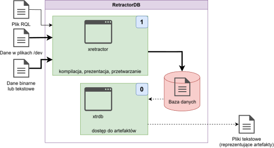

# Analiza artefaktów

Analizując szerzej potencjalne ścieżki danych na Rys. 7 ostatnią nieopisaną ścieżką jest ścieżka w której bierze udział narzędzie xtrdb.

W trakcie tworzenia systemu potrzebowałem narzędzia umożliwiającego dostęp do artefaktów w celu przeprowadzenia testów integracyjnych. W celu weryfikacji poprawności musiałem porównać wyniki przetwarzania na różnych etapach.

<figure><figcaption></figcaption></figure>

<p align="center">Rys. 13. Przepływ danych w analizie artefaktów</p>

W celu przedstawienia procesu analizy artefaktów konieczne jest uwzględnienie całego ciągu przetwarzania. Użyjemy tego samego zapytania co poprzednio. Uruchomimy jednak nasz proces przetwarzania danych w trochę inny sposób.

```
$ xretractor -m 10 query.rql
```

Tak wywołany proces przetwarzania zapytań zakończy swoją pracę po 10 sekundach. Po zakończeniu działania i przejrzeniu katalogu w którym realizowaliśmy zapytanie powinniśmy zobaczyć następujące pliki:

```
$ ls -al
total 32
drwxr-xr-x  2 michal michal 4096 Oct  4 18:01 .
drwxr-xr-x 10 michal michal 4096 Oct  4 17:59 ..
-rw-r--r--  1 michal michal   51 Oct  4 18:01 core0.desc
-rw-r--r--  1 michal michal   43 Oct  4 18:01 core1.desc
-rw-r--r--  1 michal michal   27 Oct  4 17:59 datafile1.txt
-rw-r--r--  1 michal michal  180 Oct  4 18:00 query.rql
-rw-r--r--  1 michal michal   72 Oct  4 18:01 str1
-rw-r--r--  1 michal michal   34 Oct  4 18:01 str1.desc
```

Jak widać powstały trzy pliki .desc i jeden plik z artefaktami. Jeśli zajrzymy do pliku str1 to zobaczymy bardzo skromną zawartość:

```
$ hexdump str1
0000000 0014 0000 0015 0000 0015 0000 0016 0000
0000010 0016 0000 0017 0000 0017 0000 0018 0000
0000020 0018 0000 0019 0000 0019 0000 001a 0000
0000030 001a 0000 001b 0000 001b 0000 001c 0000
0000040 001c 0000 001d 0000
0000048
```

Wraz z plikiem artefaktu powstają pliki metadanych. Ich zawartość informuje o strukturze pliku.

```
$ cat str1.desc
{       INTEGER str1_0
        INTEGER str1_1
}
```

O wiele ciekawsze są opisy plików efemerydów. Pliki opisu danych efemerycznych wskazują na pliki w systemie Linux.

```
$ cat core0.desc
{       INTEGER a
        REF "datafile1.txt"
        TYPE TEXTSOURCE
}
$ cat core1.desc
{       BYTE a
        REF "/dev/urandom"
        TYPE DEVICE
}
```

Pliki opisu metadanych są tworzone automatycznie w momencie zarejestrowania w systemie RetractorDB obiektu. Należy pamiętać aby usunąć te deskryptory w przypadku zmodyfikowania pliku query.rql

Po uruchomieniu programu xtrdb w terminalu narzędzie wyświetli znak zachęty w postaci kropki. Można od razu rozpocząć komunikację z tym narzędziem. Przykład sesji:

```
$ xtrdb
.open str1
ok
.desc
{       INTEGER str1_0
        INTEGER str1_1
}
.read 0
ok
.print
{       str1_0:20
        str1_1:21
}
.quit
```

Praca z tym narzędziem przypomina pracę z klasyczną, starą bazą danych dbase. Nie mamy tu jednak maszyny stanów, pętli czy warunków. Tylko odczyt i modyfikacje plików binarnych opisanych metadanymi.

Głównym celem tego narzędzia było wsparcie przy tworzeniu skryptów testowych. RetractorDB jest deterministyczny. W systemie nie występuje zjawisko wyścigu – dane, które trafią na wejście – zawsze powinny dać te same wyniki na wyjściu. Chyba że zmieszamy wyniki z danymi przypadkowymi jak w przedstawionym przykładzie.

Bardzo użyteczną funkcją w tym narzędziu jest funkcja list oraz rlist. Listująca początkowe elementy pliku lub końcowe elementy pliku –uwzględniając strukturę opisaną w metadanych.

```
.list 4
{ str1_0:20 str1_1:21 }
{ str1_0:21 str1_1:22 }
{ str1_0:22 str1_1:23 }
{ str1_0:23 str1_1:24 }
.rlist 4
{ str1_0:28 str1_1:29 }
{ str1_0:27 str1_1:28 }
{ str1_0:26 str1_1:27 }
{ str1_0:25 str1_1:26 }
```

Zachęcam do eksperymentów i przejrzenia źródeł tego narzędzia. Jest to jeden z mniej skomplikowanych a bardzo użytecznych elementów systemu RetractorDB.
