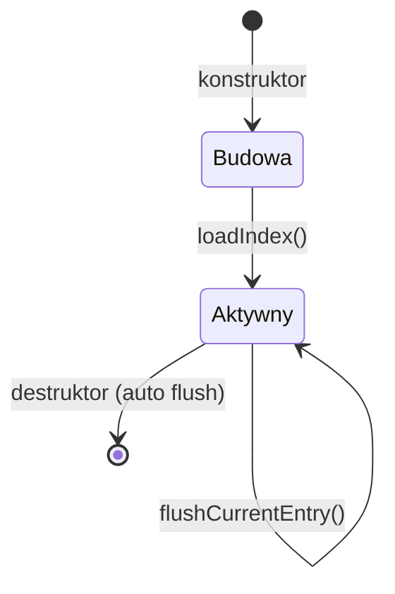
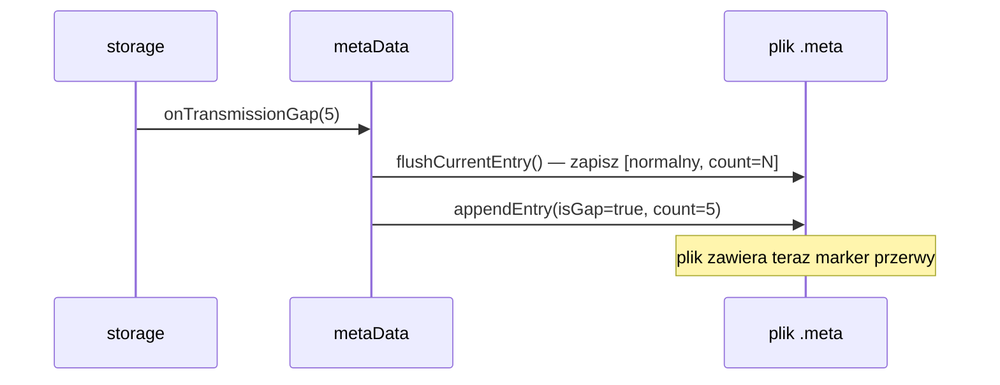
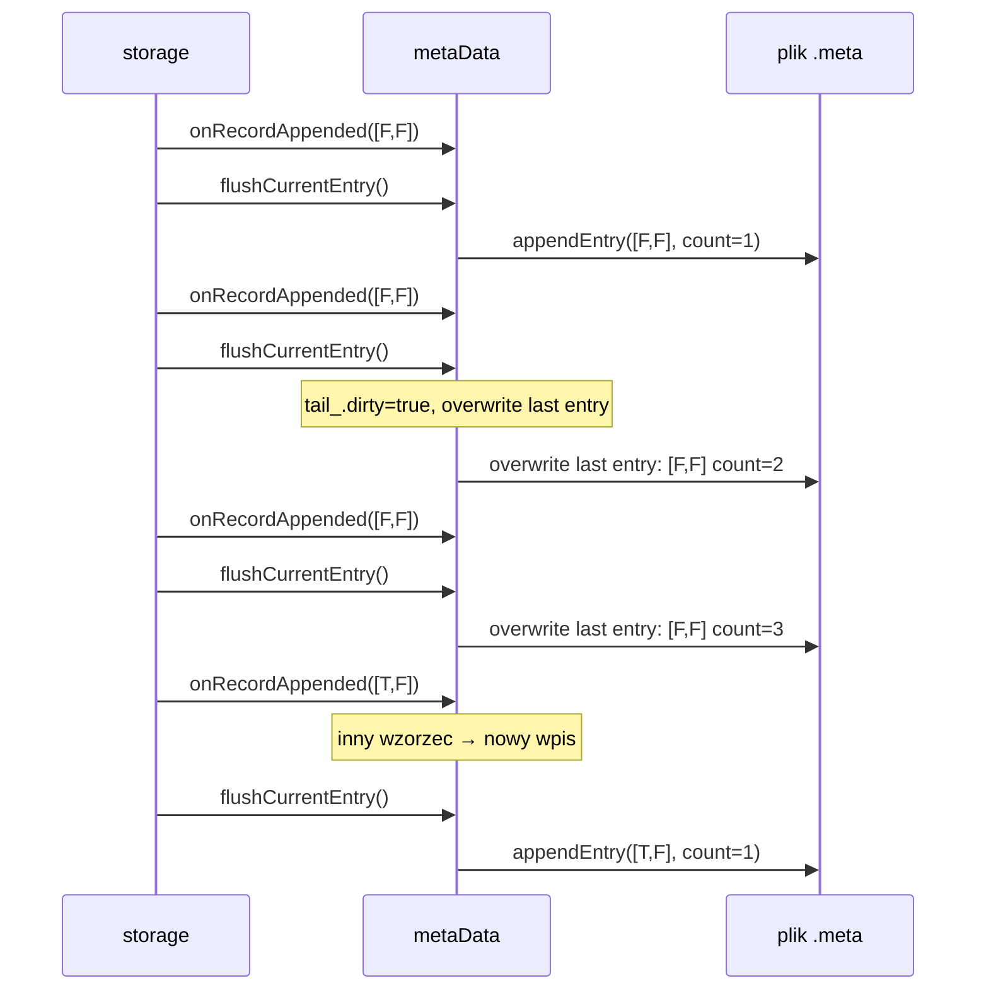
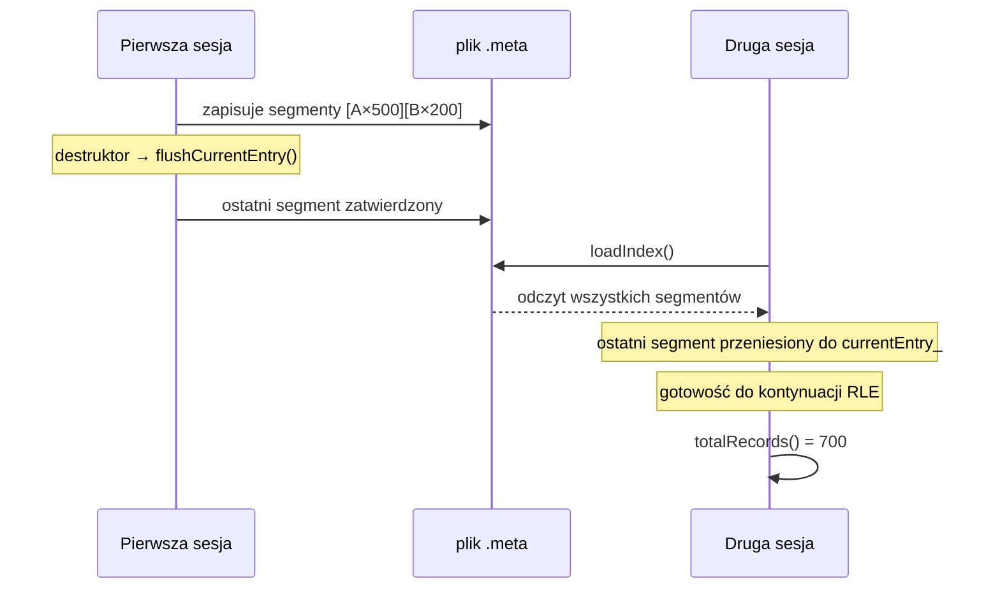
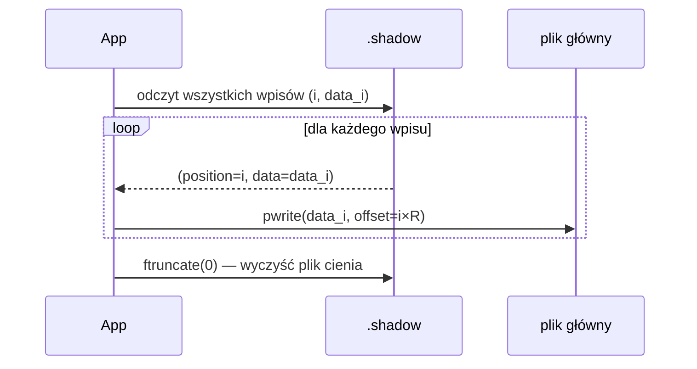
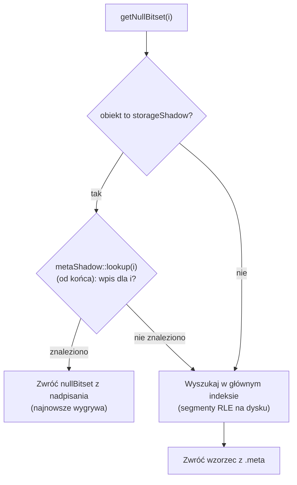
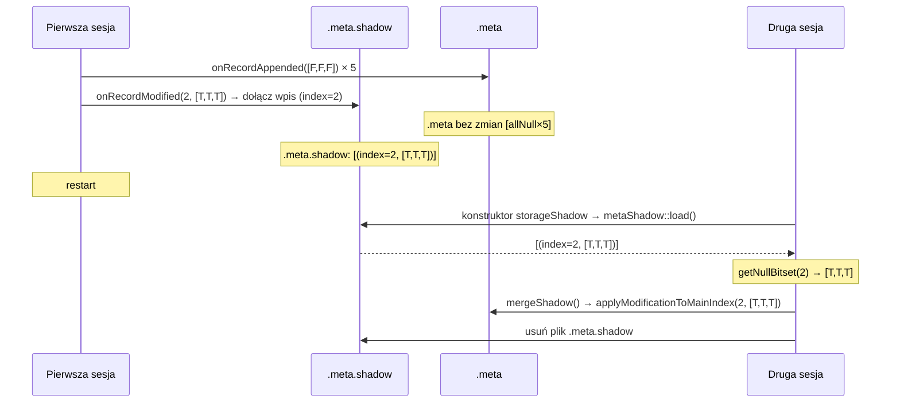
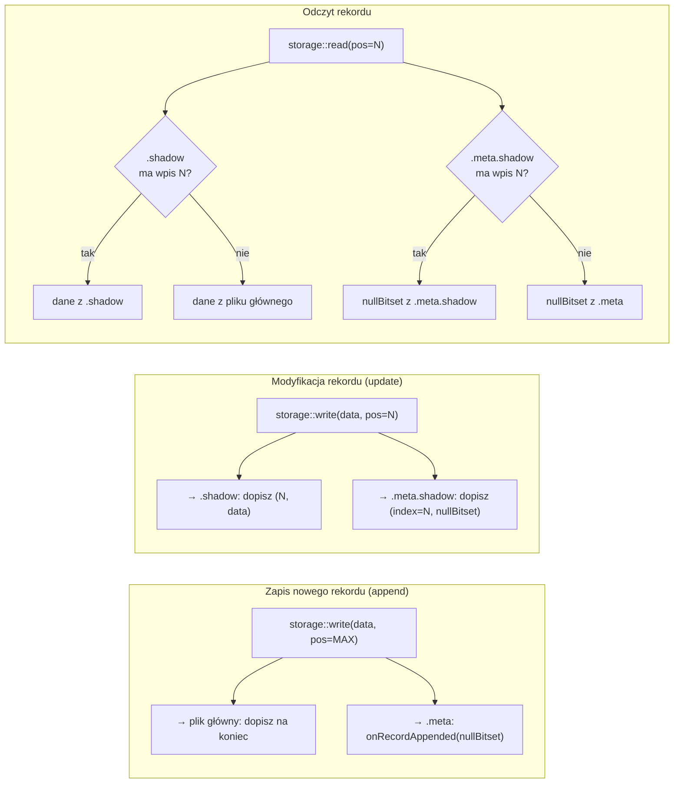

# Pliki

Rozdział opisuje pięć plików tworzących kompletny zestaw artefaktu lub substratu: deskryptor schematu (`.desc`), główny plik danych binarnych, indeks metadanych (`.meta`), plik cienia danych (`.shadow`) i plik cienia indeksu (`.meta.shadow`). Dla każdego pliku przedstawiono format binarny, semantykę pól oraz reguły zapisu i odczytu. Rozdział obejmuje też klasę `metaData` — mechanizm kompresji RLE, obsługę przerw w transmisji, interfejs aktualizacji i persystencję po restarcie. Sekcja końcowa pokazuje relacje między wszystkimi plikami na poziomie operacji `append`, `update` i `read`.

Zakres rozdziału **nie obejmuje** mechanizmu rotacji plików między sesjami (→ [Rotacja](rotacja.md)) ani narzędzia inspekcji `xtrdb -s` (→ [Narzędzie inspekcji](narzedzie-inspekcji.md)).

---

## Plik deskryptora (.desc)

Plik `.desc` opisuje strukturę rekordu. Jest parsowany przez gramatykę ANTLR4 (`DESC.g4`) i może zawierać pola danych, metainformację o typie składowania oraz politykę retencji.

### Składnia

```
{ <polecenie>* }
```

Każde polecenie to jedno z poniższych:

```
BYTE     nazwa [N]          # tablica N bajtów (domyślnie N=1)
INTEGER  nazwa [N]          # 32-bitowe liczby całkowite ze znakiem
UINT     nazwa [N]          # 32-bitowe bez znaku
FLOAT    nazwa [N]          # 32-bitowe zmiennoprzecinkowe (IEEE 754)
DOUBLE   nazwa [N]          # 64-bitowe zmiennoprzecinkowe
RATIONAL nazwa [N]          # para int32: licznik i mianownik
STRING   nazwa [rozmiar]    # ciąg znaków o stałej długości
REF      "ścieżka/plik"     # referencja do zewnętrznego pliku deskryptora
TYPE     identyfikator      # typ składowania (DEFAULT, MEMORY, POSIXSHD, …)
RETENTION pojemność segment # retencja cykliczna na dysku
RETMEMORY pojemność         # retencja cykliczna w pamięci
```

### Przykłady plików `.desc`

**Artefakt domyślny** — dwa pola numeryczne, składowanie `DEFAULT` (plik danych + plik cienia):

```
{
  INTEGER  ts
  FLOAT    value
  TYPE     DEFAULT
}
```

**Efemeryd** — strumień ulotny wyłącznie w RAM:

```
{
  DOUBLE   x
  DOUBLE   y
  TYPE     MEMORY
}
```

**Substrat z retencją** — cykliczny bufor ostatnich 1000 rekordów na dysku (10 segmentów po 100):

```
{
  INTEGER  ts
  FLOAT    a
  FLOAT    b
  TYPE     DEFAULT
  RETENTION 1000 100
}
```

**Deklaracja źródła binarnego** (`DECLARE` w RQL generuje ten schemat):

```
{
  INTEGER  a
  FLOAT    b
  TYPE     DEVICE
  REF      "sensor/data.bin"
}
```

### Rozmiary typów pól

| Typ        | Rozmiar pojedynczej wartości |
| ---------- | ---------------------------- |
| `BYTE`     | 1 B                          |
| `INTEGER`  | 4 B                          |
| `UINT`     | 4 B                          |
| `FLOAT`    | 4 B                          |
| `DOUBLE`   | 8 B                          |
| `RATIONAL` | 8 B (dwa int32)              |
| `STRING`   | N B (deklarowany rozmiar)    |

Dla pól tablicowych `nazwa[N]` całkowity rozmiar = rozmiar_typu × N. Pola `TYPE`, `REF`, `RETENTION` i `RETMEMORY` nie zajmują miejsca w rekordzie — są metadanymi deskryptora.

Rozmiar rekordu `R` = suma rozmiarów wszystkich pól danych.

### Układ pola RATIONAL

Pole `RATIONAL` przechowuje liczbę wymierną jako parę liczb całkowitych ze znakiem,
zapisaną w rekordzie wprost, bez nagłówka i bez znacznika typu:

```
offset +0   int32   licznik
offset +4   int32   mianownik
```

Kolejność bajtów jest natywna dla maszyny — na x86-64 i ARM64 little-endian, tak samo
jak dla pól `INTEGER` i `UINT`. Pole zajmuje 8 bajtów; dla pola tablicowego
`RATIONAL nazwa[N]` pary leżą jedna za drugą, `8 × N` bajtów.

Wartość jest zawsze zapisana w **postaci nieskracalnej**, a mianownik jest zawsze
**dodatni** — znak liczby niesie wyłącznie licznik. Wynika to z arytmetyki
`boost::rational`, która normalizuje wynik przy każdym przypisaniu, a nie z konwencji
zapisu. W szczególności:

* zero zapisuje się jako `0/1`, nigdy jako `0/0` ani `0/5`;
* liczba całkowita zapisuje się jako `n/1` — pole `RATIONAL` o mianowniku 1 to
  dokładnie liczba całkowita, bez zaokrągleń (na tym niezmienniku opiera się też test
  podzielności slotu w [algorytmie przeglądu drzewa zapytań](../../realizacja-zapytan/algorytm-przegladu-drzewa-zapytan.md));
* mianownik nigdy nie jest zerem, więc czytelnik nie musi tego przypadku obsługiwać.

Pola typu `RATIONAL` produkują reduktory `MIN`, `MAX`, `AVG` i `SUMC` — zarówno w postaci
funkcyjnej, jak i w wygaszanej notacji przyrostkowej `.min`, `.max`, `.avg`, `.sumc`
(→ [Operatory agregujące](../../konstrukcja-jezyka-zapytan/polecenie-select/operatory-agregujace.md)).
Reduktor jest w praktyce jedynym źródłem tego typu w artefakcie.

#### Przykład zmierzony

Plan liczący średnią z okna trzech próbek:

```rql
DECLARE v INTEGER STREAM src, 1 FILE 'data.txt'

SELECT * STREAM ravg FROM AVG(src@(1,3))
```

dla wejścia `-3, -3, -2, 7, 7, 7, …` daje deskryptor `{ RATIONAL avg }` i plik danych,
w którym pierwszy rekord ma osiem bajtów:

```
f8 ff ff ff   03 00 00 00
└─ licznik ─┘ └ mianownik ┘
   -8            3            →  -8/3
```

Czwarty rekord to `07 00 00 00 01 00 00 00`, czyli `7/1` — średnia z trzech siódemek
zapisana jako liczba wymierna o mianowniku 1, a nie jako `INTEGER`.

#### Odczyt bez rozbierania bajtów

Układ pary trzeba znać tylko przy czytaniu pliku binarnego wprost. Sam fakt, że pole jest
typu `RATIONAL` i zajmuje 8 bajtów, wypisuje `xtrdb -s nazwa` z deskryptora
(→ [Narzędzie inspekcji](narzedzie-inspekcji.md)) — narzędzie pokazuje strukturę, nie wartości.
Wartość odczytuje się natomiast, przepuszczając pole przez konwersję już w zapytaniu; trzy
funkcje dają trzy różne kompromisy:

| Zapis w SELECT | Wynik dla `-8/3` | Uwaga |
| -------------- | ---------------- | ----- |
| `to_string(pole : N)` | napis `-8/3` w polu `STRING[N]` | postać dokładna; liczba całkowita wychodzi jako `7/1`, nie `7` |
| `to_double(pole)` | pole `DOUBLE` o wartości `-2.6666…` | przybliżenie, ale bez utraty znaku i rzędu wielkości |
| `to_integer(pole)` | pole `INTEGER` o wartości `-2` | **obcięcie w stronę zera**, nie podłoga — → [Operatory agregujące](../../konstrukcja-jezyka-zapytan/polecenie-select/operatory-agregujace.md) |

Do eksportu do systemów tekstowych właściwe jest `to_string`, bo zachowuje wartość
dokładnie; `to_integer` jest wygodne, ale gubi część ułamkową i robi to inaczej, niż
podłoguje Python — opis zaokrąglenia jest przy funkcjach wyrażeń.

### Pole TYPE a strategia składowania

Pole `TYPE` w deskryptorze bezpośrednio wyznacza, który akcesor (`FileInterface`) zostanie użyty przez `storage::initializeAccessor()`. Brak pola `TYPE` jest równoznaczny z `DEFAULT`. Wartość jest nieczuła na wielkość liter (`MEMORY` = `memory`).

---

## Plik danych binarnych

Plik danych to sekwencja rekordów o stałej długości, zapisywanych jeden po drugim bez żadnego nagłówka. Rozmiar pojedynczego rekordu `R` wyznaczany jest przez deskryptor jako suma bajtów wszystkich pól.

| Offset w pliku | Zawartość  | Rozmiar  |
| -------------- | ---------- | -------- |
| 0              | Rekord 0   | R bajtów |
| R              | Rekord 1   | R bajtów |
| 2R             | Rekord 2   | R bajtów |
| ...            | ...        | ...      |
| (N-1) × R      | Rekord N-1 | R bajtów |

Każdy rekord zawiera upakowane wartości pól w kolejności zdefiniowanej przez deskryptor:

| Offset w rekordzie             | Pole    | Rozmiar       |
| ------------------------------ | ------- | ------------- |
| 0                              | pole\_0 | len\_0 bajtów |
| len\_0                         | pole\_1 | len\_1 bajtów |
| len\_0 + len\_1                | ...     | ...           |
| len\_0 + len\_1 + ... + len\_n | pole\_n | len\_n bajtów |

Operacja **append** (dodanie nowego rekordu) dopisuje dane na koniec pliku. Operacja **update** (modyfikacja istniejącego rekordu) — jeśli istnieje plik cienia — trafia do pliku cienia, a nie do pliku głównego.

### Przykład

```
DECLARE a INTEGER, b FLOAT STREAM str1, 0.1 FILE 'data.dat'
```

Rozmiar rekordu: INTEGER (4 B) + FLOAT (4 B) = **8 bajtów**. Po 5 sekundach napływu danych (10 Hz) plik `data.dat` ma rozmiar 5 × 10 × 8 = **400 bajtów**.

---

## Plik metadanych (.meta)

Plik `.meta` to indeks wartości null i przerw w transmisji. Przechowuje informację o tym, które pola rekordów mają wartość null i gdzie wystąpiły przerwy — bez duplikowania samych danych.

### Format pliku

| Pozycja    | Zawartość                                  | Rozmiar  |
| ---------- | ------------------------------------------ | -------- |
| Nagłówek   | `creationTimeNs` (int64)                   | 8 bajtów |
| Wpis RLE 0 | `gapFlag \| count \| bitsetSize \| bitset` | zmienny  |
| Wpis RLE 1 | `gapFlag \| count \| bitsetSize \| bitset` | zmienny  |
| ...        | ...                                        | ...      |
| Wpis RLE k | wpis bieżący (w pamięci)                   | zmienny  |

### Format wpisu RLE

Każdy wpis opisuje ciąg kolejnych rekordów z identycznym wzorcem null:

| Pole          | Rozmiar       | Opis                             |
| ------------- | ------------- | -------------------------------- |
| `gapFlag`     | 1 B           | 0 = normalny rekord, 1 = przerwa |
| `recordCount` | 8 B (size\_t) | liczba rekordów w ciągu          |
| `bitsetSize`  | 8 B (size\_t) | liczba pól (N)                   |
| `bitset`      | ⌈N/8⌉ B       | bit i = pole i ma wartość null   |

### Kompresja RLE

Kolejne rekordy z tym samym wzorcem null są scalane w jeden wpis przez zwiększenie `recordCount`. Nowy wpis tworzony jest dopiero gdy wzorzec się zmienia.

**10 rekordów, 2 pola, bez null:**

| Wpis   | isGap | count | bitset |
| ------ | ----- | ----- | ------ |
| wpis 0 | F     | 10    | \[F,F] |

**Null w polu 1 od rekordu 5:**

| Wpis   | isGap | count | bitset |
| ------ | ----- | ----- | ------ |
| wpis 0 | F     | 5     | \[F,F] |
| wpis 1 | F     | 5     | \[F,T] |

**Przerwa w transmisji po rekordzie 3:**

| Wpis   | isGap | count | bitset |
| ------ | ----- | ----- | ------ |
| wpis 0 | F     | 3     | \[F,F] |
| wpis 1 | T     | 7     | \[T,T] |
| wpis 2 | F     | ...   | \[F,F] |

### Marker przerwy w transmisji (gap)

Przerwa w transmisji (np. wyłączenie systemu, zanik sygnału) rejestrowana jest jako wpis z `isGap=true` i wszystkimi bitami null ustawionymi na `true`. Parametr `count` przechowuje długość przerwy w jednostkach interwału strumienia. Sam plik danych binarnych nie zawiera żadnych dodatkowych rekordów dla przerwy — informacja żyje wyłącznie w pliku `.meta`.

> **_NOTE:_** Opisana funkcjonalność ma pokrycie w testach: `issue113_meta_internal`, `issue113_meta_autocreate` opisanych w załączniku pt. [Testy Integracyjne](../../zalaczniki/testy-integracyjne.md).

---

### Klasa metaData

Plikiem `.meta` zarządza klasa `rdb::metaData`. Jest ona koordynatorem: sama utrzymuje politykę RLE (leniwe nadpisanie ostatniego wpisu, numeracja rekordów), a wyspecjalizowane fragmenty deleguje do osobnych jednostek:

| Jednostka | Nagłówek | Rola |
| --------- | -------- | ---- |
| `IndexRecord` | `indexRecord.hpp` | format pojedynczego wpisu i jego (de)serializacja |
| `MetaIndexStore` | `metaIndexStore.hpp` | surowe I/O pliku `.meta` — nagłówek, wpisy zatwierdzone, cache |
| `GapDetector` | `gapDetector.hpp` | maszyna stanów wykrywania przerw (nullfill, absorpcja, przerwa oczekująca) |
| `splitSegment()`, `sumNonGapRecords()` | `rleSegment.hpp` | operacje na segmentach RLE |
| `storageShadow` | `storageShadow.hpp` | wariant kierujący aktualizacje do cienia indeksu (`.meta.shadow`) |

Sama `metaData` hermetyzuje trzy obszary odpowiedzialności:

1. **Agregację RLE w pamięci** — buforuje bieżący segment (ostatnią serię rekordów z identycznym wzorcem null) w polu `currentEntry_`, nie zapisując go do pliku przy każdym rekordzie.
2. **Trwałość danych** — wyłącznie zakończone segmenty (gdy wzorzec się zmienia lub gdy nastąpi jawne wywołanie `flushCurrentEntry()`) trafiają do pliku jako wpisy zatwierdzone (_committed_).
3. **Indeks zapytań** — udostępnia interfejs do odpytywania wzorca null dla dowolnego rekordu oraz wykrywania przerw w transmisji.

Klasa przechowuje dwa stany:

| Stan | Lokalizacja | Opis |
| ---- | ----------- | ---- |
| Zatwierdzone segmenty | plik `.meta` na dysku | wszystkie zakończone przebiegi RLE |
| Segment bieżący (`currentEntry_`) | pamięć operacyjna | aktualnie akumulowany przebieg (jeszcze niezapisany lub do nadpisania) |

### Cykl życia obiektu

Diagram stanów (Rys. 15) przedstawia przejścia między fazami obiektu `metaData`:



_Rys. 15. Cykl życia obiektu metaData_

**Konstruktor** (`metaData(descriptor, path)`):
- Inicjalizuje pusty `currentEntry_` na podstawie liczby pól deskryptora.
- Wywołuje `loadIndex()` — jeżeli plik istnieje, wczytuje wszystkie zatwierdzone segmenty, wyznacza `committedRecordCount_`, a ostatni niegapowy segment przenosi z powrotem do `currentEntry_` (umożliwia kontynuację serii RLE po restarcie).
- Jeżeli plik nie istnieje, tworzy go i zapisuje nagłówek (znacznik czasu utworzenia strumienia).

**Destruktor** automatycznie wywołuje `flushCurrentEntry()`, gwarantując, że bieżący bufor trafi na dysk nawet gdy program zakończy pracę w normalnym trybie.

### Interfejs aktualizacji

Klasa wyróżnia trzy scenariusze zmiany stanu metadanych:

#### `onRecordAppended(nullBitset)`

Wywoływany przez `storage` po każdym dołączeniu nowego rekordu do pliku danych.

```
wzorzec identyczny z currentEntry_?
├─ TAK → zwiększ currentEntry_.recordCount (akumulacja RLE, brak I/O)
└─ NIE → flushCurrentEntry() (poprzedni segment na dysk)
          ustaw currentEntry_ = {nullBitset, count=1}
```

Operacja I/O następuje **wyłącznie przy zmianie wzorca** — dla serii identycznych rekordów koszt to jedna inkrementacja licznika w pamięci.

#### `onRecordModified(index, nullBitset)`

Wywoływany przez `storage` przy aktualizacji istniejącego rekordu. Zachowanie zależy od trybu pracy:

**Tryb normalny** (brak pliku cienia danych): lokalizuje rekord w segmentach RLE i rozbija segment na maksymalnie trzy części: przed modyfikowanym rekordem, sam rekord, za nim.

```
rekord w currentEntry_ (pamięć)?
├─ TAK → splitSegment() w pamięci, nowe fragmenty dołączone do pliku
└─ NIE → wczytaj plik, splitSegment(), przepisz plik (rewriteFile)
```

Przykład rozbicia segmentu `[allNull × 5]` przy modyfikacji rekordu 2:

```
Przed:  [allNull × 5]
Po:     [allNull × 2] [allPresent × 1] [allNull × 2]
```

**Wariant z cieniem** (`storageShadow`, wstrzykiwany zamiast bazowego `metaData` dla magazynów utrzymujących plik `.shadow`): zamiast modyfikować główny indeks, dopisuje jedno nadpisanie wzorca null do pliku `.meta.shadow`. Główny indeks `.meta` pozostaje nienaruszony i spójny z głównym plikiem danych.

```
obiekt indeksu to storageShadow?
├─ TAK → metaShadow::appendOverride(index, nullBitset) → wpis w .meta.shadow
└─ NIE → modyfikacja głównego indeksu → splitSegment()
```

#### `onTransmissionGap(duration)`

Rejestruje przerwę w transmisji o podanej długości (w jednostkach interwału strumienia). Najpierw zatwierdza bieżący segment (`flushCurrentEntry()`), następnie dołącza do pliku wpis z `isGap=true` (Rys. 16).



_Rys. 16. Sekwencja rejestracji przerwy — onTransmissionGap_

### Mechanizm bezpieczeństwa: `flushCurrentEntry()` i nadpisywanie (tail_.dirty)

Klasa `storage` wywołuje `flushCurrentEntry()` po **każdym** wywołaniu `write()`, aby zagwarantować przeżycie awarii procesu. Naiwna implementacja dopisywałaby nowy wpis do pliku przy każdym flushu — powodując wzrost pliku proporcjonalny do liczby rekordów, nawet bez zmian wzorca null.

Rozwiązanie: mechanizm **lazy overwrite** oznaczany flagą `tail_.dirty`.

```
flushCurrentEntry() → zapis [wzorzec, count=2] na dysk
onRecordAppended(ten sam wzorzec):
    currentEntry_.count = 2 (przywrócony z dysku)
    tail_.markDirty()        ← następny flush nadpisze, nie doda
    currentEntry_.count++    → count = 3
flushCurrentEntry() → seek na ostatni wpis, overwrite [wzorzec, count=3]
    (rozmiar pliku bez zmian)
```

Diagram sekwencji dla typowego wzorca `storage` (append + flush po każdym rekordzie) ilustruje Rys. 17:



_Rys. 17. Mechanizm lazy overwrite — nadpisywanie ostatniego wpisu .meta_

Dzięki temu plik `.meta` rośnie wyłącznie przy **zmianie wzorca null** — nie przy każdym rekordzie. Przy ciągłym napływie jednorodnych danych plik ma stały rozmiar niezależnie od liczby rekordów.

### Persystencja i odtwarzanie stanu

Po restarcie procesu nowy obiekt `metaData` wczytuje plik przez `loadIndex()` (sekwencja na Rys. 18):

1. Odczytuje nagłówek — znacznik czasu (`creationTimeNs`), przechowywany jako `int64` nanosekund od epoki.
2. Wczytuje wszystkie zatwierdzone wpisy z pliku.
3. Jeżeli ostatni wpis **nie jest gap-em** — przenosi go z powrotem do `currentEntry_` i usuwa z pliku (umożliwia kontynuację RLE po restarcie bez duplikacji).
4. Wyznacza `committedRecordCount_` jako sumę `recordCount` wszystkich niegalowych wpisów pozostałych w pliku.



_Rys. 18. Persystencja i odtwarzanie stanu po restarcie_

### Interfejs zapytań

| Metoda | Opis         |
| ----   | ------------ |
| `getNullBitset(i)` | Zwraca wzorzec null dla rekordu `i`. Metoda wirtualna: w wariancie `storageShadow` najpierw sprawdza nadpisania w `metaShadow` (od końca — ostatnie wygrywa), a dopiero przy braku wpisu sięga do głównego indeksu. |
| `nullBitsetFor(i)` | Jak wyżej, ale dla rekordu spoza zakresu indeksu zwraca wzorzec „nic nie jest null" zamiast rzucać wyjątkiem. Pozwala `storage::read()` nakładać metadane null bez kontroli zakresu. |
| `isGapBefore(i)` | Zwraca `true`, jeżeli bezpośrednio przed rekordem `i` w indeksie RLE znajduje się wpis `isGap=true`. Rekord 0 nigdy nie ma przerwy przed sobą. |
| `segments()` | Zwraca wszystkie segmenty RLE: zatwierdzone (z dysku) oraz bieżący (z pamięci), jeżeli jest niepusty. Nie obejmuje nadpisań z `.meta.shadow`. Służy do inspekcji i testów. |
| `totalRecords()` | Suma rekordów we wszystkich segmentach (committed + pending). |
| `isEmpty()` | Skrót: `totalRecords() == 0`. |
| `rotate(percounter)` | Rotuje plik indeksu: przemianowuje bieżący plik `.meta` na `.meta.old<N>`, tworzy nowy pusty plik. Wywoływana przez `storage::detectStartupState()` po wykryciu rotacji pliku danych (plik danych pusty, indeks niepusty). Gdy `percounter < 0`, plik nie jest przemianowywany — wykonywany jest tylko reset indeksu. |
| `reset()` | Czyści indeks w miejscu: zeruje liczniki, przepisuje plik z samym nagłówkiem bez zmiany jego nazwy. Wywołuje też `discardShadow()`. Wywoływany przez `storage` przy czyszczeniu bez zachowania historii (np. po `purge()`). |

### Interfejs cienia indeksu

Metody klasy `storageShadow` — wariantu indeksu wstrzykiwanego przez `makeMetaIndex()` dla magazynów utrzymujących plik cienia danych. Bazowy `metaData` ich nie ma; nie ma też przełącznika trybu, bo o obecności cienia decyduje wybór klasy przy inicjalizacji magazynu.

| Metoda | Opis         |
| ----   | ------------ |
| konstruktor | Wczytuje istniejące nadpisania z pliku `.meta.shadow` (`metaShadow::load()`), przywracając stan cienia po restarcie procesu. |
| `mergeShadow()` | Scala nadpisania z cienia do głównego indeksu (aplikuje każde nadpisanie w kolejności zapisu — ostatnie wygrywa), a następnie usuwa plik `.meta.shadow`. Odpowiednik `merge()` dla pliku cienia danych. |
| `discardShadow()` | Czyści listę nadpisań w pamięci i usuwa plik `.meta.shadow`. Wywoływany przy odrzuceniu cienia danych (purge, reset, rotacja). |
| `metaShadowFilePath(p)` | Statyczna: zwraca ścieżkę pliku cienia indeksu odpowiadającą danemu plikowi `.meta`, bez tworzenia obiektu. Używana przez `storage` przy porządkowaniu zasobów. |

### Przykład użycia — typowy scenariusz produkcyjny

```
storage.write(rec0)           → onRecordAppended([F,F,F]) + flushCurrentEntry()
storage.write(rec1)           → onRecordAppended([F,F,F]) + flushCurrentEntry()
storage.write(rec2_val_null)  → onRecordAppended([T,F,F]) + flushCurrentEntry()
storage.write(rec3)           → onRecordAppended([F,F,F]) + flushCurrentEntry()

Plik .meta po powyższych operacjach (4 flushe, 2 segmenty):
  [isGap=F, count=2, bitset=[F,F,F]]   ← wpis 0
  [isGap=F, count=1, bitset=[T,F,F]]   ← wpis 1  (rec2)
  [isGap=F, count=1, bitset=[F,F,F]]   ← wpis 2  (rec3, bieżący w pamięci)

getNullBitset(2) → [T,F,F]   (pole 0 rekordu 2 jest null)
isGapBefore(2)  → false
totalRecords()  → 4
```

---

## Plik cienia (.shadow)

Plik cienia umożliwia modyfikację zarejestrowanych rekordów bez niszczenia danych oryginalnych. Usunięcie pliku `.shadow` przywraca oryginalny stan danych.

### Format wpisu

| Pole       | Rozmiar       | Opis                           |
| ---------- | ------------- | ------------------------------ |
| `position` | 8 B (size\_t) | indeks rekordu w pliku głównym |
| `data`     | R bajtów      | nowe wartości rekordu          |

Każda modyfikacja dopisuje nowy wpis na koniec pliku cienia. Przy wielu modyfikacjach tego samego rekordu plik może zawierać wiele wpisów dla tej samej pozycji — aktualny jest ostatni.

### Priorytety odczytu

Priorytety odczytu to reguła rozstrzygania, z którego źródła system ma zwrócić wartość rekordu, gdy ten sam indeks może występować jednocześnie w pliku głównym i w pliku cienia. W RetractorDB priorytet definiowany jest deterministycznie: najpierw sprawdzany jest `.shadow` (od końca, aby wybrać najnowszą modyfikację), a dopiero przy braku wpisu wykonywany jest odczyt z pliku głównego. Pojęcie to dotyczy aspektu **spójności i wersjonowania odczytu** danych po modyfikacjach, a nie samego fizycznego formatu zapisu rekordu w pliku binarnym.


_Rys. 19. Priorytety odczytu rekordu z pliku cienia_

Rys. 19 przedstawia logikę odczytu rekordu: system najpierw sprawdza wpis w `.shadow`, a dopiero przy jego braku odczytuje rekord z pliku głównego.

### Scalanie (merge)

Operacja `merge()` scala zmiany z pliku cienia do pliku głównego i zeruje plik cienia. Po scaleniu dane oryginalne są bezpowrotnie nadpisane.



_Rys. 20. Scalanie pliku cienia z plikiem głównym_

Rys. 20 przedstawia przebieg `merge()`: kolejne wpisy `(position, data)` z `.shadow` są zapisywane do pliku głównego, a po zakończeniu plik cienia jest czyszczony.

### Przykład: modyfikacja rekordu

```
# Strumień str1: 2 pola INTEGER (4B każde), recordSize = 8B
# Rekord 2 (oryginał): [100, 200]
# Modyfikacja: pole 0 → 999

# Plik .shadow po modyfikacji:
# offset 0: [position=2 (8B)][999, 200 (8B)]
```

Odczyt rekordu 2 zwróci `[999, 200]`. Odczyt rekordu 0 i 1 zwróci dane z pliku głównego (nie ma ich w shadow).

---

## Plik cienia indeksu (.meta.shadow)

Plik `.meta.shadow` jest odpowiednikiem `.shadow` na poziomie indeksu null. Rejestruje nadpisania wzorców null dla poszczególnych rekordów bez modyfikowania głównego pliku `.meta`, zachowując spójność pary: `plik główny ↔ .meta` oraz `plik cienia ↔ .meta.shadow`.

### Kiedy powstaje

Plik `.meta.shadow` jest tworzony automatycznie, gdy spełnione są dwa warunki:

1. Magazyn jest typu `DEFAULT` lub `POSIXSHD` — czyli taki, który trzyma modyfikacje rekordów w pliku `.shadow` (nie w pliku głównym).
2. W danej sesji wykonana zostanie przynajmniej jedna modyfikacja istniejącego rekordu (`storage::write()` na indeks inny niż maksymalny).

Warunek 1 nie jest przełącznikiem trybu, lecz **wyborem klasy**. Przy inicjalizacji magazynu fabryka `makeMetaIndex()` (`accessorFactory.hpp`) pyta akcesor o `hasShadow()` i zwraca:

| Warunek | Zwracany obiekt | Zachowanie |
| ------- | --------------- | ---------- |
| źródło deklarowane (`DECLARE`) | `metaData` z pustą ścieżką | wariant inertny — indeks działa w pamięci, nic nie trafia na dysk |
| akcesor ma plik cienia danych | `storageShadow` | `onRecordModified()` kieruje nadpisania do `metaShadow` (`.meta.shadow`) |
| pozostałe | `metaData` | modyfikacje przepisują główny indeks `.meta` |

`storageShadow` dziedziczy po `metaData` i nadpisuje wirtualne `onRecordModified()`, `getNullBitset()` oraz `reset()`; samym plikiem `.meta.shadow` zarządza jego pole typu `metaShadow`. Dzięki temu `storage` nie zawiera żadnego rozgałęzienia na tryb cienia.

### Format pliku

Plik `.meta.shadow` nie ma nagłówka. Jest sekwencją wpisów w tym samym formacie binarnym co wpisy w pliku `.meta`, z tą różnicą, że pole `recordCount` przechowuje **bezwzględny indeks rekordu** (nie liczbę rekordów w serii RLE):

| Pole         | Rozmiar       | Znaczenie w `.meta.shadow`            |
| ------------ | ------------- | ------------------------------------- |
| `gapFlag`    | 1 B           | zawsze 0 (nadpisania nie są przerwami) |
| `recordCount`| 8 B (size\_t) | bezwzględny indeks nadpisywanego rekordu |
| `bitsetSize` | 8 B (size\_t) | liczba pól deskryptora (N)            |
| `bitset`     | ⌈N/8⌉ B       | nowy wzorzec null dla tego rekordu    |

Każde wywołanie `onRecordModified()` w trybie cienia dopisuje jeden wpis na koniec pliku. Wiele wpisów dla tej samej pozycji jest dozwolone — obowiązuje **ostatni** wpis (semantyka „last-write-wins", zgodna z plikiem `.shadow`).

### Priorytety odczytu

`storageShadow::getNullBitset(i)` skanuje listę nadpisań od końca. Jeżeli znajdzie wpis dla indeksu `i`, zwraca jego wzorzec null bez sięgania do głównego indeksu (Rys. 21):



_Rys. 21. Priorytety odczytu wzorca null — główny indeks vs. cień indeksu_

### Cykl życia

Plik `.meta.shadow` jest zarządzany równolegle z plikiem cienia danych:

| Zdarzenie na pliku `.shadow` | Akcja na `.meta.shadow` |
| ---------------------------- | ----------------------- |
| Pierwsza modyfikacja rekordu | Tworzenie pliku; dołączenie pierwszego wpisu |
| Kolejne modyfikacje | Dołączanie kolejnych wpisów |
| `merge()` — scalenie cienia z plikiem głównym | `mergeShadow()` — nadpisania aplikowane do `.meta`; plik usuwany |
| `purge()` / `reset()` — odrzucenie cienia | `discardShadow()` — plik usuwany bez scalania |
| Restart procesu | konstruktor `storageShadow` → `metaShadow::load()` — plik odczytywany; nadpisania przywrócone w pamięci |
| Usunięcie tymczasowego magazynu (destruktor) | Plik `.meta.shadow` usuwany razem z `.meta` |

### Persystencja po restarcie

Po restarcie procesu nowy obiekt `storageShadow` przywraca stan cienia już w konstruktorze, przez `metaShadow::load()` (Rys. 22):

1. Odczytuje wszystkie wpisy z `.meta.shadow` (brak nagłówka — format bezpośredni).
2. Ładuje je do listy nadpisań w kolejności zapisu.
3. `getNullBitset()` i kolejne `onRecordModified()` działają tak samo jak przed restartem.



_Rys. 22. Cień indeksu — odtwarzanie wzorców null po restarcie_

### Przykład użycia — korekta rekordu z zachowaniem spójności

```
# 5 rekordów w strumieniu str1, 3 pola FLOAT
# Rekord 2 ma wartość null w polu 0: nullBitset=[T,F,F]
# Operator koryguje pole 0 rekordu 2 → zmiana wzorca na [F,F,F]

# Operacje:
storage.write(rec2_corrected, pos=2)
  → .shadow: dołącz (position=2, data_corrected)
  → storageShadow.onRecordModified(2, [F,F,F])
    → .meta.shadow: dołącz (index=2, [F,F,F])

# Stan plików:
# .meta        — bez zmian: [isGap=F, count=2, [F,F,F]], 
# >> [isGap=F, count=1, [T,F,F]], [isGap=F, count=2, [F,F,F]]
# .meta.shadow — nowy wpis: [gapFlag=0, recordCount=2, bitset=[F,F,F]]

# Odczyt:
getNullBitset(2) → [F,F,F]  (z .meta.shadow)
getNullBitset(1) → [F,F,F]  (z .meta)

# Po scaleniu:
storage.merge() → .shadow wchłonięty do pliku głównego
storageShadow.mergeShadow() → .meta przebudowany, .meta.shadow usunięty
# .meta po merge: [isGap=F, count=5, [F,F,F]]  (wszystkie rekordy pełne)
```

> **_NOTE:_** Mechanizm `.meta.shadow` jest testowany w testach jednostkowych `ut_metaShadow_usage` (format i cykl życia pliku cienia) oraz `ut_storageShadow_usage` (integracja z `metaData` i akcesorem).

---

## Relacja pomiędzy plikami

W tej części relacje między plikami są pokazane na dwóch poziomach. Poziom strukturalny opisuje, że plik danych jest nośnikiem rekordów, deskryptor `.desc` definiuje ich format, plik `.meta` przechowuje informację o wartościach null i przerwach transmisji, `.shadow` gromadzi modyfikacje danych bez niszczenia oryginału, a `.meta.shadow` gromadzi analogicznie nadpisania wzorców null. Poziom operacyjny (Rys. 23) pokazuje przebieg odczytu i zapisu: odczyt najpierw sprawdza `.shadow` i `.meta.shadow`, `merge()` przenosi poprawki do pliku głównego i głównego indeksu, a operacje `append`, `update` i `read` utrzymują spójność danych i metadanych w całym cyklu życia artefaktu.



_Rys. 23. Relacja pomiędzy operacjami zapisu, modyfikacji i odczytu artefaktu_

Rys. 23 przedstawia przepływ operacji `append`, `update` i `read` przez warstwę `storage` oraz ich bezpośredni wpływ na plik danych, `.meta`, `.shadow` i `.meta.shadow`.

## Punkt wyjścia — plik binarny bez metadanych

Najprostszy możliwy zapis serii czasowej to sekwencja surowych wartości w pliku binarnym: stały rozmiar rekordu, brak nagłówka, brak opisu struktury. Takie podejście ma jedną zaletę — minimalny narzut — i szereg istotnych ograniczeń:

- Interpretacja danych wymaga wiedzy zewnętrznej wobec pliku (nazwy pól, typy, kolejność).
- Brak informacji o przerwach w transmisji — ciągłość danych jest pozorna.
- Każda modyfikacja historycznego rekordu niszczy dane oryginalne nieodwracalnie.
- Zmiana struktury rekordu unieważnia cały plik.

RetractorDB rejestruje dane z czujników działających w czasie rzeczywistym, gdzie przerwy zasilania, zaniki sygnału i konieczność retrospektywnej korekty danych są normalnym zjawiskiem eksploatacyjnym, nie wyjątkiem. Struktura czterech plików odpowiada bezpośrednio na każde z tych ograniczeń.

## Co wnosi każdy plik

**Deskryptor (`.desc`) — samoopisywalność i niezależność od kodu**

Plik danych binarnych jest bezużyteczny bez znajomości struktury rekordu. Deskryptor przechowuje tę wiedzę obok danych, co oznacza:

- Dane można odczytać i zinterpretować bez dostępu do kodu źródłowego ani konfiguracji — wystarczy plik `.desc`.
- Narzędzie `xtrdb` może analizować dowolny artefakt bez dodatkowych parametrów.
- Zmiana struktury strumienia (dodanie pola, zmiana typu) jest jawna i wersjonowalna.
- Pole `TYPE` w deskryptorze decyduje o strategii składowania, co pozwala temu samemu silnikowi obsługiwać trwałe artefakty, ulotne efemerydy i zewnętrzne źródła danych bez zmiany logiki zapytań.

**Plik metadanych (`.meta`) — wiarygodność serii czasowej**

Seria czasowa z dziurami, traktowana jako ciągła, prowadzi do błędnych obliczeń okien czasowych, błędnych agregacji i fałszywych korelacji. Plik `.meta` zapewnia:

- Odróżnienie rekordu z wartością zero od rekordu nieobecnego (null) — semantycznie zupełnie różnych stanów.
- Rejestrację przerw w transmisji bez wstawiania fikcyjnych rekordów do pliku danych — plik binarny pozostaje gęsty i adresowalny pozycyjnie.
- Kompresję RLE — typowe serie czasowe mają długie okresy bez null, więc koszt metadanych jest bliski zeru dla danych dobrej jakości.
- Możliwość odtworzenia dokładnego harmonogramu rejestracji, w tym długości przerw, co jest niezbędne przy obliczaniu interwałów w algebrze strumieni.

**Plik cienia (`.shadow`) — niedestruktywna korekta danych**

W systemach pomiarowych korekta błędnych próbek po fakcie jest standardową procedurą. Nadpisanie pliku binarnego jest nieodwracalne i usuwa dowód oryginalnego pomiaru. Plik cienia:

- Pozwala skorygować dowolny historyczny rekord bez modyfikacji pliku głównego.
- Zachowuje oryginalny pomiar jako domyślny — usunięcie pliku `.shadow` w pełni przywraca stan wyjściowy.
- Umożliwia scalenie (`merge`) korekt do pliku głównego wtedy, gdy jest to świadoma decyzja operatora, nie skutek uboczny zapisu.
- Separuje dane certyfikowane (plik główny) od danych roboczych (plik cienia), co ma znaczenie w zastosowaniach wymagających audytowalności.

**Plik cienia indeksu (`.meta.shadow`) — spójność metadanych przy korekcie**

Korekta rekordu w pliku cienia danych musi znaleźć odzwierciedlenie w indeksie null — inaczej `getNullBitset()` zwróciłoby przestarzały wzorzec z głównego `.meta`. Plik `.meta.shadow`:

- Utrzymuje spójność między parami: `plik główny ↔ .meta` oraz `.shadow ↔ .meta.shadow`.
- Pozwala `getNullBitset()` zwrócić aktualny wzorzec null dla skorygowanego rekordu bez modyfikowania głównego indeksu.
- Śledzi cykl życia pliku cienia danych — scalany i usuwany dokładnie razem z `.shadow`.
- Umożliwia pełne odtworzenie stanu po restarcie: nadpisania załadowane z `.meta.shadow` są natychmiast dostępne bez ponownego skanowania pliku cienia danych.