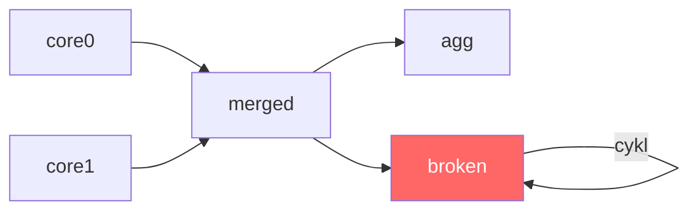

# Wykrywanie pętli w kompilacji

Graf zależności zapytań musi być acyklicznym grafem skierowanym (DAG). Jeśli zapytanie odwołuje się — bezpośrednio lub pośrednio — do własnych wyników, powstaje cykl. Kompilator wykrywa taką sytuację i kończy kompilację z błędem.

> **_NOTE:_** Opisana funkcjonalność ma pokrycie w teście: `issue95_loopInCompile` opisanym w załączniku pt. [Testy Integracyjne](../zalaczniki/testy-integracyjne.md).

## Przykład pętli

```
DECLARE a BYTE, b INTEGER \
STREAM core0, 0.1 \
FILE 'sensor_a.txt'

DECLARE c INTEGER, d FLOAT \
STREAM core1, 0.2 \
FILE 'sensor_b.txt'

SELECT merged[0]*10, merged[2]+10 STREAM merged FROM core0 + core1
SELECT * STREAM agg FROM MAX(merged)
SELECT * STREAM broken FROM merged + broken
```

Ostatnie zapytanie definiuje `broken` jako wynik operacji `merged + broken` — strumień zależy od samego siebie. Graf zależności zawiera cykl (Rys. 40):



_Rys. 40. Cykl w grafie zależności zapytań_

## Efekt kompilacji

Próba kompilacji takiego pliku kończy się błędem:

```
$ xretractor brokenQuery.rql -c 2>out.txt
$ echo $?
1
$ cat out.txt
[error] Circular dependency: stream interval resolution stalled with 1 
>> unresolved streams
```

Komunikat `"Circular dependency in stream definitions"` pojawia się, gdy etap `resolveStreamIntervals` wykryje, że liczba nierozwiązanych strumieni przestała maleć. Jak uruchomić kompilację i czytać komunikaty błędów — patrz [Debugowanie kompilacji](debugowanie-kompilacji.md).

## Mechanizm wykrywania

Etap `resolveStreamIntervals` w każdej rundzie iteracji liczy strumienie, dla których nie udało się jeszcze wyznaczyć interwału (`unresolvedCount`). W poprawnym grafie acyklicznym liczba ta maleje co rundę — zawsze co najmniej jeden strumień uzyskuje wyznaczoną deltę. W grafie z cyklem strumienie wzajemnie od siebie zależą i żaden nie może uzyskać wartości — `unresolvedCount` zatrzymuje się.

```cpp
if (unresolvedCount >= prevUnresolved) {
    SPDLOG_ERROR("Circular dependency: stream interval resolution stalled with
>> {} unresolved streams",
                 unresolvedCount);
    return std::string("Circular dependency in stream definitions");
}
prevUnresolved = unresolvedCount;
```

Warunek `>=` (a nie `>`) chroni przed fałszywymi pozytywami: jeśli liczba nie maleje nawet o jeden, postęp jest niemożliwy.

## Jak naprawić

Usunąć odwołanie strumienia do samego siebie lub do strumienia, który od niego zależy. W powyższym przykładzie zapytanie:

```
SELECT * STREAM broken FROM merged + broken
```

należy zastąpić odwołaniem do strumienia, który istnieje niezależnie od `broken`:

```
SELECT * STREAM broken FROM merged + core0
```
