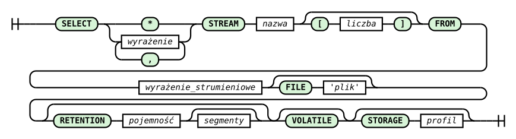

# Polecenie SELECT

Każde polecenie SELECT w systemie RetractorDB tworzy ciągłe zapytania. Zapytania te realizowane są od momentu pojawienia się w systemie aż do zakończenia pracy systemu.

Składnia polecenia SELECT przedstawia się następująco:

```
SELECT wyrażenie_algebraiczne [, wyrażenie_algebraiczne] 
STREAM nazwa_budowanego_strumienia [liczba_instancji]
FROM strumieniowe_wyrażnie_algebraiczne 
[FILE 'nazwa_pliku_artefaktu'] 
[RETENTION pojemność [segmenty]]
[VOLATILE]
[STORAGE profile]
```



_Rys. 4. Diagram składni polecenia SELECT_

Diagram składni (railroad) przedstawiony na Rys. 4 został wygenerowany na podstawie reguły `select_statement` z gramatyki ANTLR4 systemu (`RQL.g4`). Diagram czyta się, podążając liniami od lewej do prawej: zaokrąglone zielone pola to słowa kluczowe i symbole wpisywane dosłownie, prostokąty to wartości podawane przez użytkownika. Rozgałęzienie za słowem SELECT pokazuje, że lista pól to albo gwiazdka (pełny rekord), albo jedno lub więcej wyrażeń rozdzielonych przecinkami (pętla powracająca przez przecinek). Opcjonalny rozmiar w nawiasach kwadratowych po nazwie strumienia tworzy rodzinę strumieni. Tory omijające klauzule FILE, RETENTION (z opcjonalnym drugim parametrem — liczbą segmentów), VOLATILE i STORAGE oznaczają, że każda z nich jest opcjonalna.

Osoby posługujące się językiem SQL zauważą od razu że przedstawione powyżej polecenie odbiega znacząco od tego co znają z zakresu relacyjnych baz danych.

Pierwsza różnica poza składnią to fakt że polecenia te wprowadzone do systemu realizują się aż do zakończenia pracy systemu. Każde polecenie SELECT jest zapytaniem ciągłym. Klauzula STREAM wymaga nadania przez twórcę każdemu zapytaniu unikalnej nazwy. O ile wyrażenia algebraiczne na liście klauzuli SELECT nie odbiegają od formy znanej z systemów relacyjnych o tyle strumieniowe wyrażenie algebraiczne musi spełniać warunki przedstawione w poprzednim rozdziale dotyczącym wyrażeń algebraicznych. Opcjonalne klauzule FILE oraz RETENTION zapewniają procesy kierowania wyników i zarządzania formą ich retencji. Stare, podzielone pliki wynikowe mogą być usuwane na bieżąco zapewniając systemowi miejsce na nowe dane w ruchu ciągłym.

Przykładem zapytania tworzącego nowy strumień danych może być następujące polecenie w języku RQL.

```
SELECT str1[0]*10 + str1[1]*10, str1[2] \
STREAM str1 \
FROM A+B
```

Tak zbudowane zapytanie zakłada że ktoś zadeklarował strumienie A i B. Operację tą mógł wykonać za pomocą słowa kluczowego DECLARE lub innego polecenia SELECT. W oparciu tylko o wiersz zawierający zapytanie nie jesteśmy w stanie stwierdzić jak szybko dane strumienia str1 napływają. Ta informacja jest wyliczana na etapie kompilacji w oparciu o strumienie A i B i wyrażenie algebraiczne w klauzuli FROM.

## Generatory strumieni

Opcjonalny rozmiar po nazwie w klauzuli `STREAM` rozwija jeden szablon na podaną liczbę zapytań. Symbol `$` oznacza numer instancji liczony od zera:

```rql
DECLARE cell INTEGER[4] STREAM cells, 1/10 FILE 'cells.txt'

SELECT cells[$] STREAM cell[4] FROM cells
SELECT * STREAM grouped FROM cell[0]#cell[1]#cell[2]#cell[3]
```

Pierwsze polecenie `SELECT` tworzy fizyczne strumienie `cell$0`, `cell$1`, `cell$2` i `cell$3`. Odwołanie `cell[2]` w klauzuli `FROM` oznacza instancję `cell$2`; w wyrażeniu listy `SELECT` zapis `cells[2]` nadal oznacza pole o indeksie 2.

W szablonie `$` może wystąpić:

- jako indeks pola, np. `cells[$]` albo `cells[3-$]`;
- jako wartość wyrażenia, np. `cells[0]+$`;
- w odwołaniu do innej rodziny w klauzuli `FROM`, np. `cell[$]@(2,4)`.

Wyrażenie indeksu generatora jest całkowite i może zawierać literały, `$`, nawiasy oraz operatory `*`, `+` i `-`. Rozmiar rodziny musi być dodatni, a szablon musi rzeczywiście używać `$`. Generator nie może mieć klauzuli `FILE`, ponieważ jedna nazwa pliku nie może opisywać wielu strumieni. Kompilator odrzuca także indeksy poza zakresem rodziny, ujemne indeksy pól oraz kolizje nazw wygenerowanych z istniejącymi strumieniami.

Ekspansja jest pierwszym przebiegiem kompilatora. Po niej plan jest taki sam jak plan z ręcznie rozpisanymi strumieniami `cell$0`...`cell$3`; runtime nie ma osobnego mechanizmu generatorów.

> **_NOTE:_** Opisana funkcjonalność ma pokrycie w testach: `simple`, `Pattern2` opisanych w załączniku pt. [Testy Integracyjne](../../zalaczniki/testy-integracyjne.md).

Klauzula VOLATILE - tworzy ulotną formę zapytania. Zapytanie z tą klauzulą przechowują tylko jeden rekord w pamięci - na dysku pojawia się tylko deskryptor opisujący strukturę danych.

Klauzula STORAGE umożliwia wybór sposobu tworzenia i zarządzania tworzonymi artefaktami. Pełna tabela typów z opisem każdego z nich znajduje się w rozdziale [Typy STORAGE](typy-storage.md).

## Operatory klauzuli FROM

Strumieniowe wyrażenie algebraiczne w klauzuli `FROM` może zawierać:

| Operator | Składnia | Opis |
| --- | --- | --- |
| Suma | `A + B` | Konkatenacja schematów dwóch strumieni — patrz [Sekwencjonowanie sumowania](sekwencjonowanie-operacji-sumowania.md) |
| Przeplot | `A # B` | Przeplot dwóch strumieni — patrz [Sekwencjonowanie przeplotu](sekwencjonowanie-operacji-przeplotu.md) |
| Przesunięcie | `A > N` | Przesuwa odczyt o `N` próbek |
| Zmiana interwału | `A - r` | Przetaktowuje strumień do interwału wymiernego `r` |
| Rozplot | `A & r` / `A % r` | Odzyskuje lewą albo prawą składową przeplotu dla stosunku `r` |
| Okno AGSE | `A @ (k, w)` | Buduje ruchome okno danych — patrz [Ruchome okno danych AGSE](../../realizacja-zapytan/ruchome-okno-danych-agse/) |
| Redukcja | `MIN(A)` / `MAX(A)` / `AVG(A)` / `SUMC(A)` | Redukuje wielopolowy rekord do jednej wartości — patrz [Operatory agregujące](operatory-agregujace.md) |

Agregaty `MIN`/`MAX`/`AVG`/`SUMC(wyrażenie : W)` występują w liście `SELECT`, a nie w
wyrażeniu strumieniowym `FROM`. Redukują historię W rekordów i mogą być operandem większego
wyrażenia pola, na przykład `2*MIN(a : 5)+1`. Obie osie agregacji porównuje rozdział
[Operatory agregujące](operatory-agregujace.md).

### Priorytet i łączność

Od operatorów wiążących najmocniej do najsłabiej:

1. wywołanie reduktora, nazwa strumienia albo wyrażenie w nawiasach;
2. łańcuchowalne operatory przyrostkowe `@`, `&`, `%`, `>`, `-` i wygaszana postać `.agregator`;
3. przeplot `#`;
4. suma `+`.

Operatory binarne `#` i `+` są lewostronnie łączne. Operatory przyrostkowe również składają się od lewej, np. `A@(1,4)&2` oznacza `(A@(1,4))&2`.

> **⚠️ Ostrzeżenie** `A#B>N` oznacza `A#(B>N)`, ponieważ przesunięcie wiąże mocniej niż przeplot. Aby przesunąć wynik przeplotu, zapisz `(A#B)>N`. Ta sama reguła dotyczy `A#B-r`.

Spacje wokół `#` nie zmieniają znaczenia: `A # B` i `A#B` są tym samym przeplotem.

## Wyrażenia pól

Lista `SELECT` oraz warunki `RULE` używają wyrażeń skalarnych z odwołaniami do pól,
operatorami arytmetycznymi, wartościami `NULL` i funkcjami. Pełną składnię, priorytety,
listę funkcji oraz reguły konwersji opisuje rozdział
[Wyrażenia pól i funkcje skalarne](wyrazenia-pol-i-funkcje-skalarne.md).

### Potęgowanie

Operator `^` potęguje wartości liczbowe na liście `SELECT` i w warunkach `RULE`. Wiąże mocniej niż `*` i `/`, a te wiążą mocniej niż `+` i `-`. Potęgowanie jest prawostronnie łączne:

```rql
SELECT v*w^2, v^w^2 STREAM powers FROM source
```

Powyższy zapis oznacza `v*(w^2)` oraz `v^(w^2)`. Zapis `(v*w)^2` wymaga jawnych nawiasów.

Dla typów całkowitych i wymiernych nieujemna potęga całkowita ma dokładnie semantykę powtarzanego mnożenia, łącznie z promocją typu i przepełnieniem. Dla pozostałych przypadków używane jest obliczenie zmiennoprzecinkowe; wynik nieskończony albo `NaN` staje się `NULL`. Operandy tekstowe są niedozwolone.

> **ℹ Info** Literał ujemny jest jednym atomem gramatyki: `-2^2` oznacza `(-2)^2`. Dla pola `-v^2` oznacza `-(v^2)`. W razie wątpliwości użyj nawiasów.

> **⚠️ Ostrzeżenie** Po przeplocie `A#B` nie wolno odwoływać się do jego składowych przez `A[0]`, `A.pole`, `A[_]` ani `A.*`. Przeplot ma jeden wspólny schemat; użyj nazwy strumienia wynikowego albo odzyskaj składową operatorem `&`/`%`. Szczegóły opisuje rozdział [Aliasowanie](../../kompilacja-zapytan/aliasowanie.md).

> **_NOTE:_** Operator przesunięcia `A > N` ma pokrycie w teście: `issue56_timeshift` opisanym w załączniku pt. [Testy Integracyjne](../../zalaczniki/testy-integracyjne.md).

> **_NOTE:_** Propagacja wartości null przez wyrażenia SELECT ma pokrycie w teście: `issue121_null_propagation` opisanym w załączniku pt. [Testy Integracyjne](../../zalaczniki/testy-integracyjne.md).
