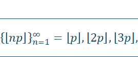

# Podstawy matematyczne

Czy wiesz co to jest medal Fieldsa? Jest to nagroda przyznawana wyłącznie wybitnym matematykom w wieku poniżej 40 lat. Nazywana jest matematycznym Noblem. Co ciekawe żaden matematyk nie otrzyma nagrody Nobla – zgodnie z życzeniem fundatora. Sam John Charles Fields (1863-1932) był Kanadyjskim matematykiem. John Charles Fields miał jednego doktoranta – Samuela Beatty (1881-1970). &#x20;

Samuel Beatty w 1926 roku opublikował następujące twierdzenie \[1]:

Jeśli p, q są dodatnimi liczbami niewymiernymi i zachodzi pomiędzy nimi zależność

 

to sekwencje

  

oraz

   

oraz dokonują podziału zbioru dodatnich liczb całkowitych.

Te dwie sekwencje dokonują podziału zbioru liczb naturalnych. Oznacza to że dysponując dwoma liczbami niewymiernymi, pomiędzy którymi wskazana w twierdzeniu zależność – będziemy mogli podzielić zbiór wszystkich liczb naturalnych na dwa rozłączne zbiory (Rys. 1).

Rys. 1 Zbiory rozłączne

Twierdzenie Beaty samo w sobie jest bardzo ciekawą obserwacją – jednak w przypadku systemów komputerowych mamy pewien problem z liczbami niewymiernymi. Liczby rzeczywiste – pomimo faktu że w niektórych językach programowania pojawia się czasem słowo Real lub Float jako reprezentanta typu liczby rzeczywistej, z liczbami rzeczywistymi nie mają wiele wspólnego. Fundamentalny problem polega na tym że ich nie mamy i zapewne nigdy mieć nie będziemy.

I tu nasza podróż gwałtownie by się skończyła gdyby nie powstało kolejne twierdzenie. Sytuacja diametralnie uległa zmianie za sprawą matematyka – Aviezri Siegmund Fraenkel (1926) specjalizującego się w kombinatorycznych aspektach teorii gier.

Przedstawił on w 1969 roku następujące twierdzenie \[2]:

Sekwencje  oraz ![](data:image/png;base64,iVBORw0KGgoAAAANSUhEUgAAAFMAAAAhCAMAAACShmf4AAAAAXNSR0IArs4c6QAAAH5QTFRFAAAAAAAAAAA6AABmADpmADqQAGa2OgAAOjo6OjpmOmaQOma2OpC2OpDbZgAAZjoAZjo6ZmaQZpCQZpC2ZpDbZrb/kDoAkGY6kLbbkNv/tmYAtmY6ttvbttv/tv//25A627Zm27aQ29u229vb2////7Zm/9uQ/9u2//+2///biiUUyAAAAAF0Uk5TAEDm2GYAAAAJcEhZcwAAFiUAABYlAUlSJPAAAAAZdEVYdFNvZnR3YXJlAE1pY3Jvc29mdCBPZmZpY2V/7TVxAAAB7klEQVRIS+1V7XaCMAylG1p1G+xL3FCHOEF4/xdcm6RpWunc2W/7q+cmuc3HJWTZ7dw6IDrQlk9/70en7r+yJv/4NWKs7pzDuNVKLfcX7hJv1NzY23J2cm7njYkyZ/HiIoeCrUOR77NzYfIIj8RNBp/WOlbkNm5Xu+9ez7PxoBXWyza+NmodUpIL4kNh04QL5DJWlqcGW6/xvY64/bXxCEaTC+K9di/iG42lGQogGyuAgjTxFXzTH1ct4o3olL0C2mtoBHnaRtDpNbgPcT9DvPYSqW0OnVVApyCUyEShWCLlL/JM4ZmPxdtBr0ALolC4tmUODRAnhZvsqEaTB5wZaMn1iq6m1+8RI7hM4bZU6i2O6LhRNCmcC/TRehz0Q0SawgWnI6+pe8xJlUwoCSq8wAWnawLOSNROQTRCn2wKF5xuKDR3PyNQBsvCc6Zw64ozYvV1qGwuyRlwRfiTwkUsc9Q4C9Y8K9ulS9QRHogMXXtaQscNaYa/zU6px1N2LuljZ+1FeFCBFYrTplq88fJzO6RWr89GtssdRjFnhAvOi/3FNkpU7BIwuYAYl432WzmYAEzN2sRmxlGS9CPcB6cfsz7w7+BaMapx2yfCmbPVefw3CJNty/XEZ0I9mPz9wYa7dkjZF24p/Brfzf6/DvwAi9wt1xO4OhsAAAAASUVORK5CYII=) dokonują podziału zbioru  wtedy i tylko wtedy gdy następujące pięć warunków zostanie spełnionych:

      Jeśli α jest liczbą niewymierną, wtedy   i  dla . Jeśli α jest liczbą wymierną, (niech  będzie najmniejszą liczbą taką że  ) wtedy  .

No i to jest to czego potrzebujemy! Liczb niewymiernych co prawda nie mamy, ale liczby wymierne rozumiane jako stosunek dwóch liczb naturalnych to jest temat do ogarnięcia za pomocą komputera.

W naszym przypadku najpierw stworzyłem prototypy równań w języku Python a następnie zacząłem poszukiwać podstaw matematycznych, które wyglądały podobnie i można było się oprzeć na nich jako dobrze udokumentowanych równaniach popartych formalnymi dowodami. Dowodami oczywiście przeprowadzonymi przez bardziej doświadczonych matematyków. Skromne umiejętności pozwoliły jednak na identyfikację tych dwóch publikacji w aspekcie moich pomysłów.

W tym dokumencie nie umieściłem formalnych dowodów. Dlatego przestawiłem tutaj jedynie stosowane w systemie równania i twierdzenia. Po formalne dowody odsyłam do moich publikacji naukowych \[3].

