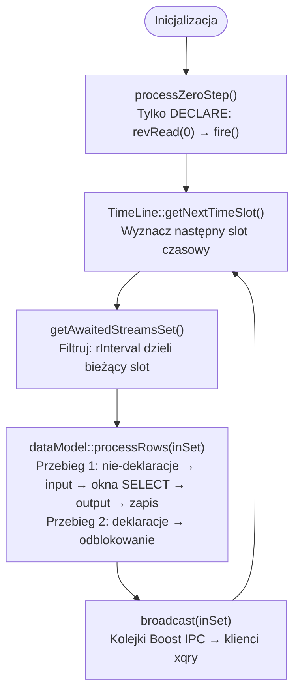
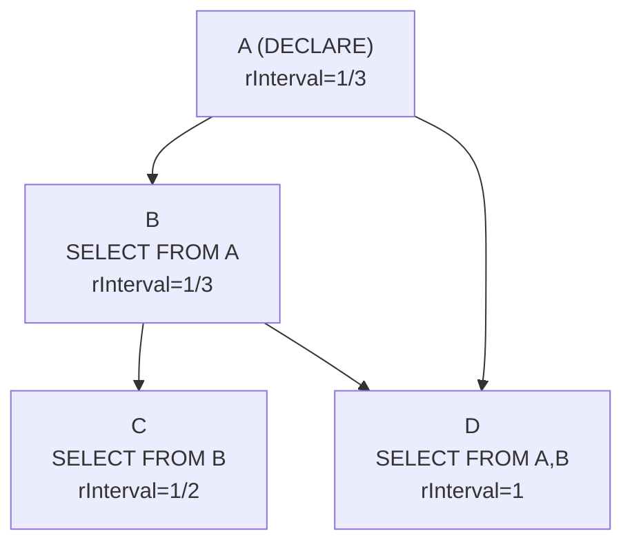
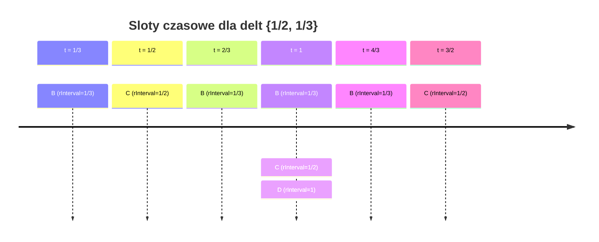
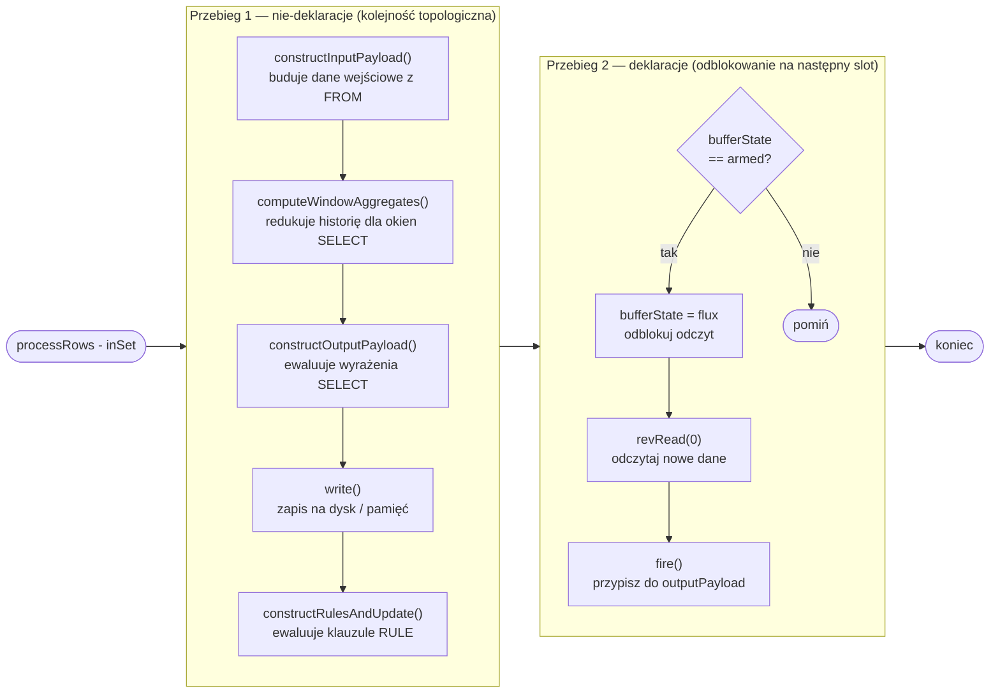
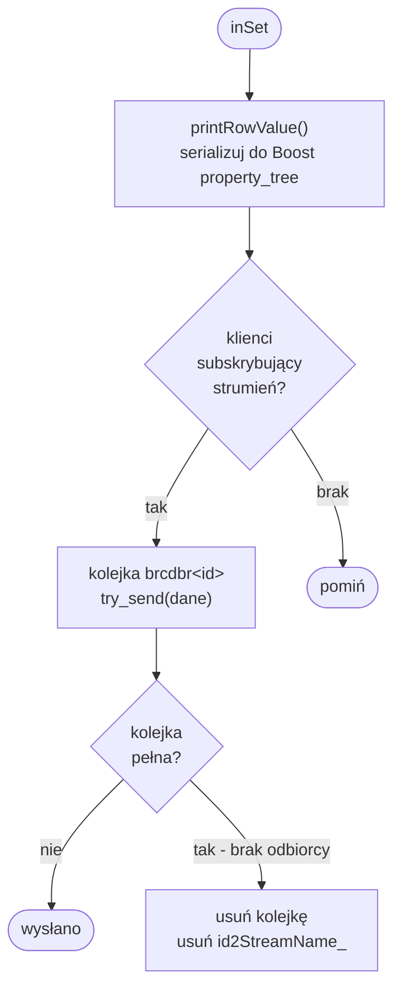
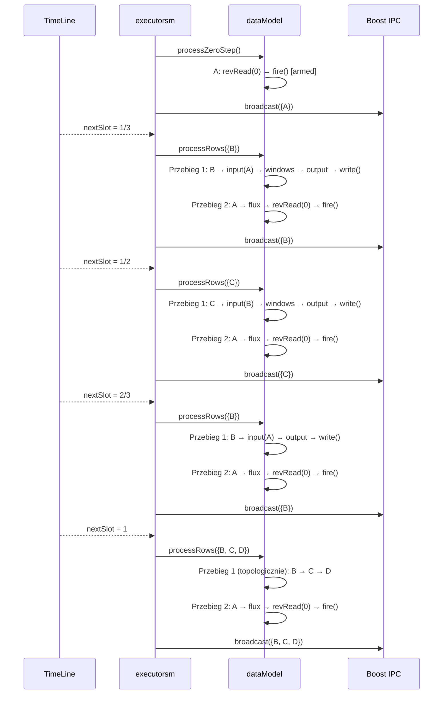

# Algorytm przeglądu drzewa zapytań

## Przegląd ogólny

Algorytm przeglądu drzewa zapytań realizowany jest przez dwa współpracujące komponenty: `dataModel` (logika przetwarzania) oraz `executorsm` (pętla czasowa i IPC). Przed wejściem w główną pętlę system wykonuje **krok zerowy**, po czym cyklicznie iteruje po minimalnym zbiorze interwałów czasowych (Rys. 41).



_Rys. 41. Algorytm przeglądu drzewa zapytań – przegląd ogólny_

***

## Struktura danych: qTree

`qTree` (`src/retractor/lib/qTree.cpp`) rozszerza `std::vector<query>` i jest **wektorem topologicznie posortowanych zapytań**. Sortowanie odbywa się przez DFS po grafie zależności budowanym z `query.getDepStream()` (Rys. 42).



_Rys. 42. Przykładowy graf zależności dla qTree_

Po sortowaniu topologicznym kolejność w wektorze: `[A, B, C, D]`. Zapytanie C zależne od B zawsze trafi po B w iteracji — gwarantuje poprawność obliczeń.

Metoda `getAvailableTimeIntervals()` wyodrębnia ze wszystkich zapytań unikalne wartości `rInterval` (z pominięciem dyrektyw kompilatora i wartości zerowych) — wynik to wejście do konstruktora `TimeLine`.

***

## Minimalna siatka czasowa: TimeLine / CRSMath

`TimeLine` (`src/retractor/lib/CRSMath.cpp`) zarządza racjonalnymi interwałami czasowymi. Konstruktor redukuje zbiór interwałów — usuwa wielokrotności, zachowując tylko koprimalne:

```
Wejście: {1/2, 1, 4}  →  Wyjście: {1/2}
(1 = 2 × 1/2, więc redundantne; 4 = 8 × 1/2, więc redundantne)

Wejście: {1/2, 1/3}  →  Wyjście: {1/2, 1/3}
(żadne nie jest wielokrotnością drugiego)
```

`getNextTimeSlot()` wyznacza kolejny slot jako `min(delta × counter[delta])` po wszystkich deltach. Poniższy diagram ilustruje sloty dla delt `{1/2, 1/3}` i aktywne zapytania w każdym z nich (Rys. 43):



_Rys. 43. Minimalna siatka czasowa dla delt {1/2, 1/3}_

Sprawdzenie `isThisDeltaAwaitCurrentTimeSlot(inDelta)` zwraca `true`, gdy `ctSlot_ / inDelta` ma mianownik równy 1 (slot jest całkowitą wielokrotnością delty zapytania).

***

## Krok zerowy: `processZeroStep()`

Przed wejściem w pętlę `executorsm::run()` wywołuje `processZeroStep()` (`dataModel.cpp`, linia \~85). Przetwarza **wyłącznie deklaracje** (strumienie wejściowe `DECLARE`):

```cpp
for (auto &q : coreInstance_) {
    if (!q.isDeclaration()) continue;
    qSet[q.id]->bufferState = flux;   // odblokuj odczyt fizyczny
    qSet[q.id]->revRead(0);           // wczytaj z indeksu 0
    qSet[q.id]->fire();               // przepisz chamber_ → outputPayload
    assert(qSet[q.id]->bufferState == armed);
}
```

Po tym kroku każda deklaracja ma `bufferState = armed` — dane z fizycznego źródła są w `outputPayload`.

***

## Główna pętla: filtrowanie i przetwarzanie

### Filtrowanie zapytań: `getAwaitedStreamsSet()`

Dla bieżącego slotu `tl` (`executorsm.cpp`, linia \~88):

```cpp
std::set<std::string> retVal;
for (auto &q : *coreInstancePtr)
    if (TimeLine::isThisDeltaAwaitCurrentTimeSlot(q.rInterval))
        retVal.insert(q.id);
return retVal;
```

Wynik `inSet` to identyfikatory zapytań aktywnych w tym slocie — podzbiór wszystkich zapytań.

### Przetwarzanie: `processRows(inSet)`

Funkcja wykonuje **dwa przejścia** przez `inSet` (`dataModel.cpp`, linia \~98), co ilustruje Rys. 44:



_Rys. 44. Algorytm processRows – dwa przejścia przetwarzania_

Deklaracje są odblokowywane dopiero po tym, jak wszystkie zależne zapytania skonsumowały ich `outputPayload` w przejściu 1.

### Okna rekordowe listy SELECT

Jeżeli zapytanie zawiera `MIN`/`MAX`/`AVG`/`SUMC(wyrażenie : W)`, etap
`computeWindowAggregates()` działa po zbudowaniu payloadu `FROM`, ale przed ewaluacją pól
wynikowych. Dla indeksu logicznego `n` czyta rekordy wskazanego źródła od `n-(W-1)` do `n`.
Gołe pole korzysta z bezpośredniego odczytu płaskiego slotu; ogólne wyrażenie jest obliczane
osobno na payloadzie każdego rekordu historii.

Wartości `NULL` są pomijane, a okno bez wartości obecnych zapisuje `NULL` dla wszystkich
czterech statystyk. Grupy o tym samym źródle, programie wyrażenia i szerokości współdzielą
jedno przejście po historii. Wyniki trafiają do `streamInstance::windowValues` i stają się
zwykłymi operandami `constructOutputPayload()`, dlatego można pisać na przykład
`2*MIN(a : 5)+1` albo `null2zero(AVG(a+b : 5))`.

***

## Rozgłaszanie wyników: `broadcast()`

Po każdym `processRows()` wywoływane jest `broadcast(inSet)` (`executorsm.cpp`, linia \~449) — algorytm przedstawia Rys. 45:



_Rys. 45. Algorytm broadcast – rozsyłanie wyników przez Boost IPC_

`printRowValue()` buduje strukturę z nazwą strumienia, liczbą pól, wartościami i bitmapą null, zapisuje jako Boost info format i wysyła przez `boost::interprocess::message_queue`.

***

## Pełny przykład: zapytania A, B, C, D dla delt {1/2, 1/3}

Rys. 46 przedstawia kompletną sekwencję wywołań dla czterech zapytań A, B, C, D rozłożonych na siatce czasowej z deltami {1/2, 1/3}.



_Rys. 46. Pełny przykład wykonania dla zapytań A, B, C, D przy deltach {1/2, 1/3}_

Drzewo zależności determinuje kolejność przejścia 1. Interwały czasowe z algebry Beatty'ego wyznaczają, które węzły drzewa są aktywne w danym slocie.

***

## Realizacja algebraiczna — powiązanie kodu z równaniami

Każdy kluczowy fragment algorytmu opisanego na tej stronie jest bezpośrednią realizacją równań z [algebry regularnych serii czasowych](../podstawy-matematyczne/algebra-regularnych-serii-czasowych.md) i [formalnych dowodów](../podstawy-matematyczne/formalne-podstawy-i-dowody.md).

### Operatory algebraiczne w `SOperations.hpp`

Plik `src/include/SOperations.hpp` koduje operatory algebry wprost jako funkcje na liczbach wymiernych:

| Operator | Symbol | Funkcja w kodzie |
|---|---|---|
| Przeplot | φ | `Hash(Δa, Δb, i, retPos)` |
| Rozplątanie lewostronne | Θ | `Div(Δa, Δb, i)` |
| Rozplątanie prawostronne | ∼Θ | `Mod(Δa, Δb, i)` |
| Różnica | δ | `Subtract(Δa, Δb, i)` |
| Agregacja i serializacja | Ψ | `agse(offset, step)` |

Każda z tych funkcji jest dosłownym przekładem wzoru z algebry. `Div` realizuje rozplątanie lewostronne:

```cpp
return i + ceilR((i + 1) * deltaA / deltaB);
```

\\[
a_{n} = c_{n+\left\lceil \frac{(n+1)\Delta_{a}}{\Delta_{b}} \right\rceil}
\\]

`Mod` realizuje rozplątanie prawostronne:

```cpp
return i + floorR(i * deltaB / deltaA);
```

\\[
b_{n} = c_{n+\left\lfloor \frac{n\Delta_{b}}{\Delta_{a}} \right\rfloor}
\\]

`Hash` implementuje test z definicji przeplotu — warunek \\(\left\lfloor iz \right\rfloor = \left\lfloor (i+1)z \right\rfloor\\) przy \\(z = \Delta_{b}/(\Delta_{a}+\Delta_{b})\\) — i zwraca odpowiedni offset do strumienia A albo B.

Pomocnicze funkcje `floorR()` i `ceilR()` operują wyłącznie na `boost::rational<int>`, nigdy nie przechodząc przez `double`. Jest to bezpośrednia realizacja wymagania z [Twierdzenia 2](../podstawy-matematyczne/formalne-podstawy-i-dowody.md): niejawne rzutowanie na `float` łamie założenia twierdzenia Fraenkela — materializacja do postaci zmiennoprzecinkowej musi być odłożona do momentu jawnego zastosowania podłogi lub sufitu.

### `TimeLine` jako minimalna baza układu pokrywającego

Konstruktor `TimeLine` wyznacza **pierwotny zbiór interwałów** — usuwa wszystkie delty będące całkowitą wielokrotnością innej delty ze zbioru. Interwał jest pierwotny, gdy żaden mniejszy interwał z zestawu nie jest jego dzielnikiem z ilorazem naturalnym. Jest to wyznaczanie minimalnego układu pokrywającego (_covering system_) w rozumieniu twierdzenia Fraenkela: tylko pierwotne delty generują niezależne sekwencje Beatty'ego i tylko one są potrzebne do wyznaczenia pełnej siatki czasowej.

Metoda `getNextTimeSlot()` — opatrzona komentarzem `// MAGIC Warning` w źródle — generuje kolejne punkty siatki jako:

\\[
t_{k} = \min_{\delta \in \mathrm{sr}} \left(\delta \cdot \mathrm{counter}[\delta]\right)
\\]

gdzie `sr` to pierwotny zbiór interwałów, a \\(\mathrm{counter}[\delta]\\) zlicza dotychczasowe „trafienia" każdej delty. Pętla dwufazowa — osobno wyznaczenie minimum, osobno inkrementacja liczników — gwarantuje poprawną obsługę kolizji: kilka delt może wyznaczać ten sam slot jednocześnie.

> **ℹ Info**
>
> Komentarz `// MAGIC Warning` w źródle `CRSMath.cpp` oznacza, że algorytm jest poprawny z nieoczywistego powodu. Nie wystarczy intuicja — poprawność gwarantuje twierdzenie Fraenkela. Ponieważ `sr` zawiera wyłącznie pierwotne interwały (żaden nie jest wielokrotnością innego), liczniki poszczególnych delt nigdy nie „wychodzą przed siebie" w sposób, który pominąłby lub zdublował slot. Kolizja — gdy dwie delty wskazują na ten sam slot — jest przypadkiem legalnym i jest obsługiwana przez drugą pętlę. „Magia" polega na tym, że prosta formuła `min(δ·counter[δ])` z automatyczną inkrementacją jest równoważna pełnemu generatorowi sekwencji Beatty'ego dla całego układu pokrywającego.

### `isThisDeltaAwaitCurrentTimeSlot()` jako test przynależności do sekwencji Beatty'ego

```cpp
boost::rational<int> value = ctSlot_ / inDelta;
return (value.denominator() == 1);
```

Test sprawdza, czy \\(t_{\mathrm{slot}} / \Delta \in \mathbb{N}\\) — czy bieżący slot jest całkowitą wielokrotnością delty zapytania. W języku teorii sekwencji Beatty'ego: punkt \\(t\\) należy do sekwencji o gęstości \\(\Delta\\) wtedy i tylko wtedy, gdy \\(t/\Delta\\) jest liczbą naturalną. Warunek na mianownik równy 1 wynika z arytmetyki `boost::rational` — ułamek jest zawsze w postaci zredukowanej, więc mianownik 1 oznacza dokładnie liczbę całkowitą bez żadnych zaokrągleń.
