# Przykład serializacji

Na początku stwórzmy plik qplan3.rql o następującej zawartości:

```
DECLARE a BYTE, b BYTE STREAM A, 1 FILE 'data3.txt'
SELECT * STREAM str3 FROM A@(1,1)
```

Oraz  przygotujmy plik data3.txt o następującej zawartości:

```
$ seq 0 9 | paste - -
```

```
0       1
2       3
4       5
6       7
8       9


```

Ostatnia, pusta linia jest istotna i znacząca. Po uruchomieniu xretractor qplan3.rql a w drugim oknie xqry -s str3 ujrzymy coś zbliżonego:

```
$ xqry -s str3
7
8
9
0
1
2
3
4
5
6
```

To co widzimy to przykład serializacji. Ciekawy aspekt operatora Agse w tym przypadku widać również w planie realizacji zapytania. Możemy zajrzeć do niego za pomocą polecenia:

```
$ xretractor -c qplan3.rql -f -p -d > out.dot && dot -Tsvg out.dot -o out.svg
```

W pliku out.svg zobaczymy następujący plan realizacji zapytania:

<figure><figcaption></figcaption></figure>

<p align="center">Rys. 19 Plan realizacji zapytania po kompilacji AGSE</p>

Ze strumienia źródłowego, w którym co sekundę przychodzą dane zawierające dwa bajty – tworzony jest strumień danych w którym co pół sekundy pojawia się jeden bajt.

Skoro mamy już w systemie strumień danych str3 zwracający sekwencyjne liczby – możemy go wykorzystać do dalszych transformacji. Dodajmy do pliku qplan3.rql następujące zapytanie:

```
SELECT * STREAM str4 FROM str3@(2,2)
```

Po uruchomieniu nie ujrzymy jednak oczekiwanej źródłowej postaci pliku dane3.txt. Pojawi się natomiast coś podobnego:

```
$ xqry -s str4
2 1
4 3
6 5
8 7
0 9
2 1
4 3
6 5
```

Na drodze trudnej sztuki przetwarzania strumieni danych znajdują się pułapki. To jedna z nich. Dopiero jak czytelnik dobrze się przyjrzy, to zauważy że dane są odbite w lustrze. Proszę zamień to zapytanie na taką formę:

```
SELECT * STREAM str4 FROM str3@(2,-2)
```

Dopiero tak zbudowany strumień przedstawi postać źródłową widoczną w pliku dane3.txt:

```
$ xqry -s str4
3 4
5 6
7 8
9 0
1 2
3 4
```

Ten minus przy wskazaniu szerokości okna, to odbicie lustrzane. Rozmiar okna wynosi dwa, natomiast sekwencja pól jest zbudowana w odwrotnej kolejności.

Generując obraz planu zapytania realizujący najpierw serializację a potem deserializację ujrzymy następującą zależność (Rys. 20):

<figure><figcaption></figcaption></figure>

<p align="center">Rys. 20 SErializacja i DEserializacja</p>

Zaprezentowano tutaj najbardziej podstawowy przykład zastosowania operatora ruchomego okna danych. Jeśli zaczniemy eksperymentować ze skokiem i rozmiarem okna, zauważymy, że jesteśmy w stanie stworzyć dowolne, przesuwające się okno nad strumieniem danych lub pominąć niektóre elementy budując skok większy od szerokości okna.

Zapis realizacji eksperymentu przedstawia się następująco:

<figure><figcaption></figcaption></figure>

